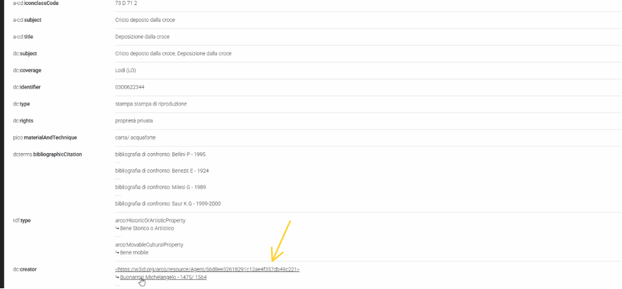
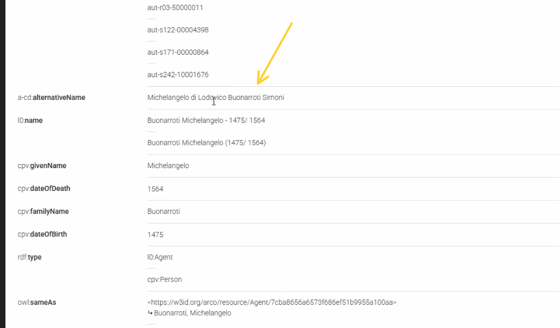
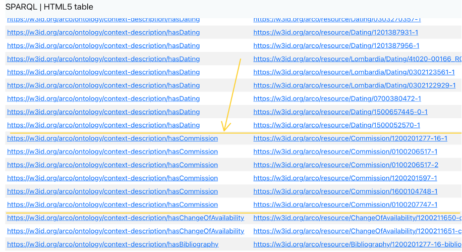
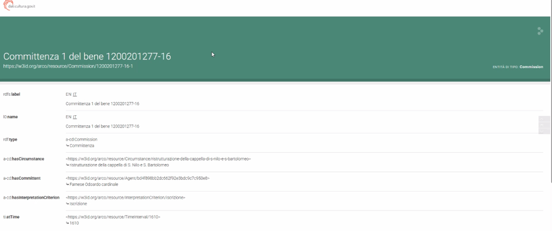
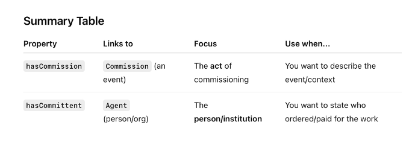
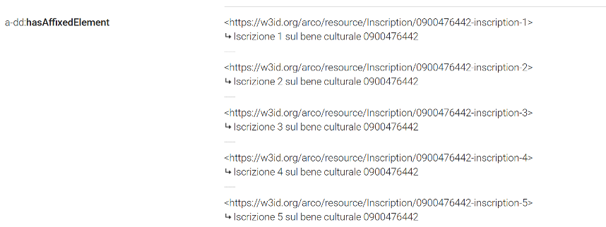
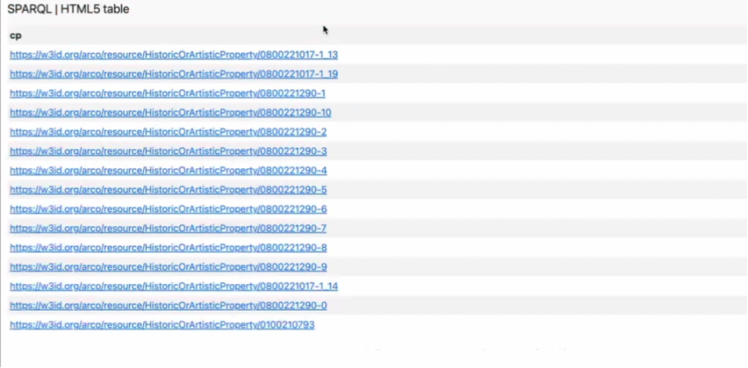
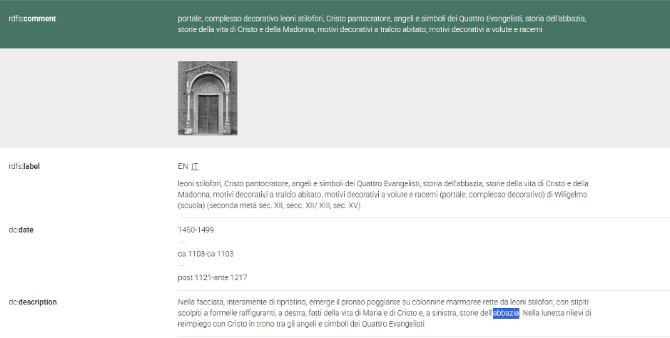

<div style="text-align: center; margin-bottom: 20px;">
  <a href="index.md">Topic</a> |
  <a href="methodology.md">Methodology</a> |
  <a href="sparql.md">SPARQL & Results</a> |
  <a href="gaps.md">Gaps</a> |
  <a href="prompts.md">LLM Prompts</a> |
  <a href="triples.md">RDF Triples</a> |
  <a href="challenges.md">Challenges</a> |
  <a href="conclusion.md">Conclusion</a>
</div>

# How We Identified the Information Gaps

## 1. Identification of the First Gap

On the basis of **Query 4**, we decided to verify whether there is truly no *Cultural Property* with the label “Abbazia di San Silvestro”, so we launched another query using the keyword **ASK**.

**Explanation of the keyword:**  
The aim of the keyword `ASK` is to test whether or not a query pattern has a solution, returning a simple **YES** or **NO**. No detailed results are returned — only whether a solution exists.

### Query 7

```sparql
PREFIX rdf: <http://www.w3.org/1999/02/22-rdf-syntax-ns#> 
PREFIX arco: <https://w3id.org/arco/ontology/arco/> 
PREFIX a-cd: <https://w3id.org/arco/ontology/context-description/> 
 
ASK
WHERE { 
  ?cp a arco:HistoricOrArtisticProperty ; 
      rdfs:label ?l . 
  FILTER(REGEX(?l, "abbazia di San Silvestro", "i")) 
}
```

### Result


The answer is false.
This confirms that the official name of our cultural property is Abbazia di Nonantola, and that Abbazia di San Silvestro — found in Query 3 as a Subject — is only an alternative name.

Then, we wanted to find out whether ArCo contains a **predicate** suitable for expressing the triple:

**“Abbazia di Nonantola’s other name is Abbazia di San Silvestro”**

To achieve this, we investigated **more famous cultural properties**, assuming they might contain richer descriptions. After running several queries, we identified a class that could be useful for our purpose: `a-cd:alternativeName`.

### Query 8

We first launched a query to locate the famous cultural property **“David di Michelangelo”**:

```sparql
PREFIX rdf: <http://www.w3.org/1999/02/22-rdf-syntax-ns#>  
PREFIX arco: <https://w3id.org/arco/ontology/arco/>  
PREFIX a-cd: <https://w3id.org/arco/ontology/context-description/>  

SELECT DISTINCT ?cp 
WHERE {  
  ?cp a arco:HistoricOrArtisticProperty ;  
      rdfs:label ?l .  
  FILTER(REGEX(?l, "david", "i"))  
  FILTER(REGEX(?l, "Michelangelo", "i"))  
}
```

### Result

From the results, we found the IRI of Michelangelo Buonarroti as an Agent:



We clicked on the Agent IRI and discovered the predicate: [a-cd:alternativeName](https://dati.beniculturali.it/lodview-arco-onto/ontology/context-description/alternativeName.html)



### Final Consideration

Even though a-cd:alternativeName appears to be a promising solution, we noticed that this property is only applied to persons (e.g., artists). Therefore, this discovery serves as inspiration, but not a direct solution.
We are now motivated to identify or create a more suitable predicate to represent alternative names for Cultural Properties, which would enable us to add the triple:

Abbazia di Nonantola → hasAlternativeName → “Abbazia di San Silvestro”

## 2. Identification of the Second Gap

Based on the results of **Query 6**, we were able to identify a missing property in the description of the **Abbazia di Nonantola**.

Specifically, we noticed that many abbeys contain the predicate `arco:hasCommission`, while our abbey does not. This suggests a **missing piece of information** regarding **who commissioned** the abbey.

To find this, we used:

- `ORDER BY` to organize the results,
- `CTRL+F` to search for the keyword **“commission”** in the output of Query 6.

### Screenshot of the discovery:



We then clicked on the **first IRI** retrieved:

[`https://w3id.org/arco/resource/Commission/1200201277-16-1`](https://w3id.org/arco/resource/Commission/1200201277-16-1)



### Further Discovery

From the details of the resource, we also found the predicate: [`a-cd:hasCommittent`](https://w3id.org/arco/ontology/context-description/hasCommittent)

This prompted a question about the **difference between** `arco:hasCommission` and `a-cd:hasCommittent`.

We asked **ChatGPT** to clarify this distinction.

  


The answer revealed that `a-cd:hasCommittent` is the **more appropriate predicate** for our case, as it specifically refers to the **entity or person who commissioned** the cultural property.

Thus, we conclude that this predicate is **missing** from the IRI of the **Abbazia di Nonantola** and should be added to **enrich its description**.

### Confirmation with ASK Query

To **double-check** whether the cultural property "Abbazia di Nonantola" includes the predicate `a-cd:hasCommittent`, we ran the following query using the **ASK** keyword:

**QUERY 9**  
```sparql
PREFIX rdfs: <http://www.w3.org/2000/01/rdf-schema#>
PREFIX arco: <https://w3id.org/arco/ontology/arco/>
PREFIX a-cd: <https://w3id.org/arco/ontology/context-description/>

ASK 
WHERE {
  ?culturalProperty a arco:HistoricOrArtisticProperty ;
                    rdfs:label "Abbazia di Nonantola"@it ;
                    a-cd:hasCommittent ?committent .
}
```

RESULT:


As shown above, the result is false, confirming that no committent is currently linked to the Abbazia di Nonantola.

### Final Conclusion

This validation supports our previous investigation:
The cultural property Abbazia di Nonantola is missing information about its committent.
To enrich its RDF description, the predicate a-cd:hasCommittent should be added, pointing to the appropriate agent.

## 3. Identification of the Third Gap

To find additional properties useful for enriching the cultural property **“Abbazia di Nonantola”**, we decided to examine **“Basilica di San Pietro”**, one of the most well-documented and relevant cultural properties in Italy.

We ran the following query to retrieve all cultural properties labeled as "Basilica di San Pietro":

**QUERY 10**  
```sparql
PREFIX rdf: <http://www.w3.org/1999/02/22-rdf-syntax-ns#>
PREFIX arco: <https://w3id.org/arco/ontology/arco/>
PREFIX a-cd: <https://w3id.org/arco/ontology/context-description/>

SELECT DISTINCT ?cp
WHERE {
  ?cp a arco:HistoricOrArtisticProperty ;
      rdfs:label ?l .
  FILTER(REGEX(?l, "Basilica di San Pietro", "i"))
}
```

### RESULT:



From the results, we identified the property arco:hasAffixedElement, which refers to inscriptions or other affixed elements.

### Inspection of Related IRIs
By clicking on one of the affixed element IRIs — specifically, [Iscrizione 1](https://dati.beniculturali.it/lodview-arco/resource/Inscription/0900476442-inscription-1.html) — we explored how ArCo models inscriptions:


### Conclusion

This analysis revealed that Abbazia di Nonantola does not yet include affixed elements such as inscriptions.
The property arco:hasAffixedElement could be used to describe any inscriptions present on the abbey, thus enhancing its semantic representation in ArCo.

### Verification for Abbazia di Nonantola

We then launched a query aimed at checking whether Abbazia di Nonantola contains any affixed elements, similarly to San Pietro.

**QUERY 11**
```sparql
PREFIX arco: <https://w3id.org/arco/ontology/arco/>
PREFIX rdfs: <http://www.w3.org/2000/01/rdf-schema#>

ASK 
WHERE {
  ?culturalProperty a arco:HistoricOrArtisticProperty ;
                    rdfs:label "Abbazia di Nonantola"@it ;
                    arco:hasAffixedElement ?affixedElement .
}
```

### Result:


The result was false, confirming that there are currently no affixed elements associated with Abbazia di Nonantola in the ArCo Knowledge Graph.

### Conclusion

This identifies a third gap: missing inscription data.
In the following phases of the project, we will consult LLMs to verify the historical existence of any inscriptions and, if applicable, add this missing information using the appropriate vocabulary.

### 4. Identification of the Fourth Gap

We launched a general query to retrieve all cultural properties connected to **Nonantola**, in order to find whether there are components or properties **indirectly related** to the Abbey of Nonantola.  
Our aim was to identify properties that could be directly connected to the Abbey through the predicate `arco:isCulturalPropertyComponentOf`.

**QUERY 12**  
```sparql
PREFIX rdf: <http://www.w3.org/1999/02/22-rdf-syntax-ns#> 
PREFIX arco: <https://w3id.org/arco/ontology/arco/> 
PREFIX a-cd: <https://w3id.org/arco/ontology/context-description/> 
 
SELECT DISTINCT ?cp 
WHERE { 
  ?cp a arco:HistoricOrArtisticProperty ; 
      rdfs:label ?l . 
  FILTER(REGEX(?l, "Nonantola", "i"))
}
```

### Results:

We found 15 results containing cultural properties related to Nonantola.

Among them, we selected the first one:
Astolfo and Anselmo, whose IRI led us to the following predicate: [arco:isCulturalPropertyComponentOf](https://dati.beniculturali.it/lodview-arco/ontology/arco/isCulturalPropertyComponentOf)



We observed that [Astolfo and Anselmo](https://dati.beniculturali.it/lodview-arco/resource/HistoricOrArtisticProperty/0800221017-1_13.html) is a component of the cultural property “Portale” (Portal).

However, the description found in the IRI of Portale mentions the Abbey and the Coverage class indicates Nonantola, but there is no clear or explicit triple connecting this portal directly to the Abbazia di Nonantola.




### Conclusion

This reveals a fourth gap: the missing relation between components and the Abbey.

To be more semantically precise, we propose to create a new triple in ArCo that explicitly connects the [IRI Portale](https://dati.beniculturali.it/lodview-arco/resource/HistoricOrArtisticProperty/0800221017-0.html) to the Abbey of Nonantola using the predicate:[arco:isCulturalPropertyComponentOf](https://dati.beniculturali.it/lodview-arco/ontology/arco/isCulturalPropertyComponentOf)

This would enrich the knowledge graph by strengthening the structural hierarchy of components within the Abbey.
