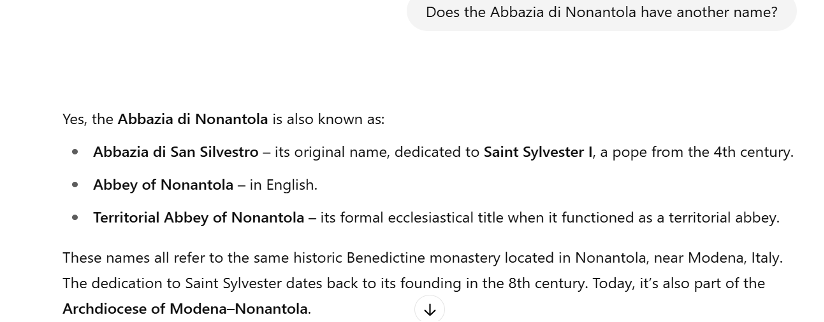
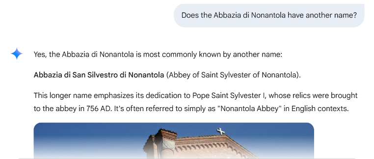

  <a href="index.html">🏠 Home</a> |
  <a href="topic.html">🏛️ Topic</a> |
  <a href="methodology.html">⚒️ Methodology</a> |
  <a href="sparql.html">📊 SPARQL&Results</a> |
  <a href="gaps.html">🔍 Identifying Gaps</a> |
  <a href="triples.html">🔗 RDF Triples</a> |
  <a href="challenges.html">⚠️ Challenges</a> |
  <a href="conclusion.html">✅ Conclusion</a>

# USE LLM TO VERIFY AND PRODUCE NEW KNOWLEDGE

We used two LLMs: [ChatGPT](https://chat.openai.com/) and [Gemini](https://gemini.google.com/)

## First Missing Information: the alternative name of the Abbazia di Nonantola

### Zero-shot Prompting Technique

According to this technique, we asked the LLMs a prompt without giving any examples or demonstrations, relying on their general understanding of language and tasks. This helps test their raw ability to provide useful answers without prior context or scaffolding.

This technique is particularly helpful when:

- A quick answer is needed
- No examples are available
- The task is generic or straightforward

In our case, this method was sufficient to extract the missing alternative name, as demonstrated below.

### [ChatGPT](https://chat.openai.com/)

- ChatGPT provided more than one name, including the one we were searching for.
- The answer was detailed: it included the **English** name of the abbey, its **ecclesiastical** name, and additional context like **location**, **dedication to San Silvestro**, **foundation date**, and **diocese**.
  
### [Gemini](https://gemini.google.com/)

- Gemini gave a more **concise and direct** response, but still provided the **correct alternative name**.
- It confirmed the **dedication to Pope San Silvestro**, added info about **relics**, and provided the **English** name of the abbey.
- Unlike ChatGPT, Gemini also included a **photo** of the abbey.

### Confirmation from Official Source

The official site of the Abbey confirms this information:

> “Da ultimo, una quarta dedicazione, questa volta a San Silvestro I papa, sarebbe avvenuta il 20 novembre 756 ad opera del vescovo Romano di Bologna. Da quel momento l’abbazia, impreziosita dal corpo del santo papa portato da Roma a Nonantola dai longobardi nel 756, assunse definitivamente il titolo di San Silvestro.”  
> — [abbazianonantola.it](https://abbazianonantola.it/)

---

## Second Missing Information: Commission

### Chain-of-Thought (Zero-shot) Technique

In this case, we applied **Chain-of-Thought** prompting in combination with the **Zero-shot** approach.

This method encourages the model to "think aloud," reasoning step-by-step before giving a final answer. It helps improve the quality of responses, especially when dealing with complex or historical topics like **commissions** involving multiple figures.

This approach was particularly effective with stronger models such as GPT-4. As shown below, [ChatGPT](https://chat.openai.com/) provided a more coherent and historically grounded answer compared to [Gemini](https://gemini.google.com/).

---

### Prompt:  
**Who was the commissioner of the Abbazia di Nonantola? Let’s think step by step**

---

### [ChatGPT](https://chat.openai.com/)

> Sure! Let's break it down step by step to identify the commissioner (or founder/patron) of the Abbazia di Nonantola:
>
> **Step 1: What is the Abbazia di Nonantola?**  
> The Abbazia di Nonantola (Abbey of Nonantola) is a historic Benedictine monastery located in the town of Nonantola, near Modena in northern Italy. It was a significant religious, cultural, and political center during the Middle Ages.
> 
> **Step 2: When was it founded?**  
> The abbey was founded in the 8th century, more precisely in the year 752.
> 
> **Step 3: Who commissioned or founded it?**
> The founder and commissioner of the abbey was:
> 
> ➤ Saint Anselm (Anselmo di Nonantola)
> 
> • He was a Lombard nobleman and the brother-in-law of King Aistulf of the Lombards.
> 
> • Anselm was a duke (duke of Friuli) before becoming a monk.
> 
> •	Around 752, he founded the abbey with the support of King Aistulf.
> 
> •	The abbey received many privileges and became one of the most powerful monastic institutions in northern Italy.
> 
> **Step 4: Support from the Lombard king**  
> •	King Aistulf of the Lombards played an important supporting role in the establishment of the abbey.
> •	He donated land and resources, helping to ensure its prominence and autonomy.

> ✅ **Final Answer**:  

> The Abbazia di Nonantola was commissioned (founded) by Saint Anselm (Anselmo di Nonantola) in 752, with the support of King Aistulf of the Lombards.

•	ChatGPT talks about “commissioner” as a synonym of “founder” and after providing us with a short historical background, it gives us a precise name: Saint Anselm. 

---

### [Gemini](https://gemini.google.com/)

> The term "commissioner" in relation to the Abbazia di Nonantola can refer to different roles throughout its long history, especially considering periods where the abbey was managed by commendatory abbots.
> Here's a breakdown:
> •	Abbots Commendatory: From 1449 onwards, the Abbey of Nonantola saw the beginning of the "Commenda" system. This meant that the abbot, known as an abbot commendatory (abate commendatario), was not necessarily a resident monk but an external figure, often appointed by the Pope or a secular ruler, who received the revenues of the abbey. These commendatory abbots effectively "commissioned" or oversaw the abbey's administration and assets, although their involvement in the spiritual life of the monastery varied greatly.
> Notable commendatory abbots included:
> •	Gurone d'Este (1449–1484)
> 
> •	Giuliano card. Della Rovere (1485–1503), who later became Pope Julius II.
> 
> •	San Carlo Borromeo (1560–1566)
> 
> •	Current Leadership: Today, the Abbazia di Nonantola is part of the Archdiocese of Modena-Nonantola. The current Archbishop-Abbot is Erio Castellucci. He serves as the spiritual and administrative head, effectively the "commissioner" in a modern sense, overseeing the abbey and its activities.
> 
> If you are looking for a specific historical period or a particular type of "commissioner," please provide more details, as the term can be interpreted in various ways for an institution with such a rich and long history.

---

---

### Refining the Answer with Few-shot Chain-of-Thought Prompting

Since [Gemini](https://gemini.google.com/) initially gave a rather ambiguous answer and failed to mention **Saint Anselm**, we decided to apply a **Few-shot Chain-of-Thought** technique.

This involves showing the model a prior example of the reasoning process for a similar question. It helps the model better understand the format of the expected answer and produce more precise reasoning.

---

**Few-shot Prompt:**

Q1: Who commissioned the Sistine Chapel ceiling?  
A1:  
Step 1: The Sistine Chapel is located in Vatican City and is famous for its ceiling painted by Michelangelo.  
Step 2: Michelangelo painted the ceiling between 1508 and 1512.  
Step 3: At that time, the pope was Julius II.  
Step 4: Pope Julius II commissioned Michelangelo to paint the ceiling as part of a renovation project.  
**Final Answer: Pope Julius II.**

Q2: Who was the commissioner of the Abbazia di Nonantola? Let’s think step by step.

---

### [Gemini](https://gemini.google.com/) Answer:

> The question of who "commissioned" the Abbazia di Nonantola can have multiple answers depending on the historical period and what specific aspect of the abbey is being referred to, as the term "commissioner" can encompass various roles from founder to later administrators.  
>
> • **Step 1: The Foundation.** The Abbazia di Nonantola was founded in 752 AD as a Benedictine monastery.
> 
> • **Step 2: The Founder.** The founder and first abbot of the Abbazia di Nonantola was **Saint Anselm**, brother-in-law of King Aistulf of the Lombards.
>  
> • **Step 3: Later Commissions and Administration.** Over the centuries, various individuals held significant roles in the abbey's development and administration. From 1449 onwards, the abbey came under the system of commendatory abbots (abati commendatari). These were external figures, often appointed by the Pope, who effectively oversaw the abbey's assets and administration. Notable commendatory abbots include Gurone d'Este (1449–1484), Giuliano card. Della Rovere (1485–1503, who later became Pope Julius II), and San Carlo Borromeo (1560–1566). During their tenure, specific commissions for works within the abbey might have been made by them, such as the main altar by Jacopo Silla de Longhi (1568-1572) on commission by Abbot Guido Ferreri.** 
>
> • **Step 4: Current Leadership.** Today, the Abbazia is part of the Archdiocese of Modena-Nonantola. The current Archbishop-Abbot, who serves as the spiritual and administrative head, is **Erio Castellucci**.

> ✅ **Final Answer:**  
> The original founder of the Abbazia di Nonantola was Saint Anselm. Later, during the commenda system, various commendatory abbots oversaw its administration and commissioned works, including Abbot Guido Ferreri. In the modern era, the spiritual and administrative head is the Archbishop-Abbot, currently Erio Castellucci.

---

### Evaluation

- This answer is **more complete and historically structured** compared to the previous attempt by Gemini.
- The mention of **Saint Anselm** finally appears, showing that our few-shot example improved the model's comprehension of the question and expected reasoning.
- The model also provided information about **later commissioners**, such as commendatory abbots and modern leadership.
- Unlike ChatGPT, Gemini also **included a picture**, enhancing the visual aspect of the answer.
- Due to the **length and completeness** of the answers, we decided to **paste the transcriptions** instead of screenshots for clarity.

---

### Cross-Validation

The official site of the abbey confirms the historical foundation:

> 🏛️ [Abbazia di Nonantola – Official Website](https://abbazianonantola.it/)  
>  
> **ASTOLFO E ANSELMO: LA FONDAZIONE MONASTICA E LA SUA DEDICAZIONE**  
>  
> La fondazione dell’abbazia di Nonantola si colloca nel quadro storico - politico dell’insediamento dei Longobardi nel modenese. All’origine vi fu una donazione di terre: nel 752 Astolfo donò al cognato Anselmo, “olim dux militum, nunc dux monachorum”, la terra definita nelle fonti “locum Nonantulae”. Dopo un periodo di permanenza a Fanano, sull’appennino modenese, dove aveva fondato un ospizio nei pressi del Passo della Croce Arcana, Anselmo, su incarico di Astolfo, si trasferì a Nonantola coi suoi monaci. Qui vi fondò un monastero: si tratta di uno dei monasteri più insigni ed antichi della Val Padana, forse la prima vera e propria fondazione benedettina in tutto il nord Italia. I futuri sviluppi del monastero finirono per superare gli intenti e le previsioni dei suoi fondatori. Il monastero, dotato di numerosissime pertinenze la cui estensione non era inferiore ai 400 chilometri quadrati, godeva della proprietà della pesca, dei mulini, dei ponti, dei boschi, dei pascoli e delle numerose chiese e cappelle poste nel rispettivo territorio, con diritti fiscali che davano all’abate anche la facoltà di riscuotere i contributi dei sudditi del monastero.

---
