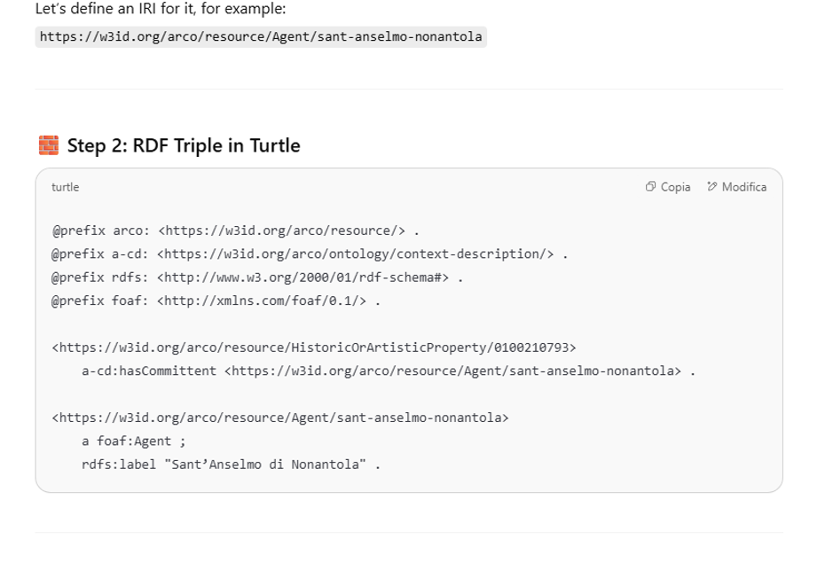
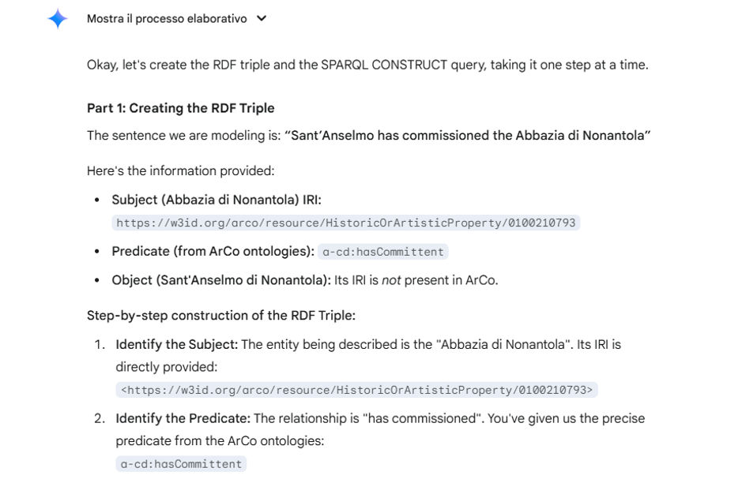
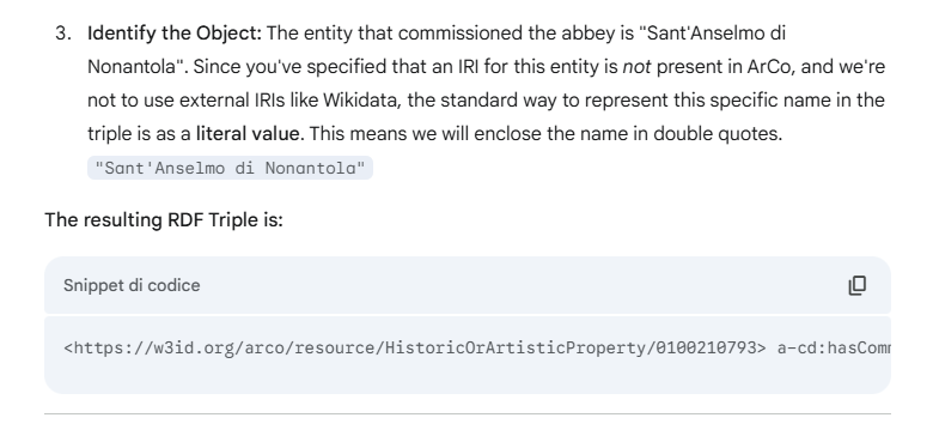

<div style="text-align: center; margin-bottom: 20px;">
  <a href="index.html">🏠 Home</a> |
  <a href="topic.html">🏛️ Topic</a> |
  <a href="methodology.html">⚒️ Methodology</a> |
  <a href="sparql.html">📊 SPARQL&Results</a> |
  <a href="gaps.html">🔍 Identifying Gaps</a> |
  <a href="prompts.html">💬 LLM Prompts</a> |
  <a href="challenges.html">⚠️ Challenges</a> |
  <a href="conclusion.html">✅ Conclusion</a>
</div>

---

# Generating our new triples

## 1. Triple of the first missing information

It is important to mention that since the Abbazia di Nonantola is not present in ArCo as an `ArchitecturalHeritage` (a subclass of `arco:ImmovableCulturalProperty`), we were only able to find **representations** of it. For this reason, in the following series of triples, we chose the IRI:  
`https://w3id.org/arco/resource/HistoricOrArtisticProperty/0100210793`  
Among the two results retrieved as cultural properties with the mention “Abbazia di Nonantola” in the title, this one is the closest representation of the abbey. The other refers only to an affixed element, a component of the artistic complex.

---

### Few-shot prompt for LLMs

We showed the following example prompt:

> **Subject:** [Michelangelo Buonarroti](https://w3id.org/arco/resource/Agent/56d8ee32618291c12ae4f357db49c221)  
> **Predicate:** `a-cd:alternativeName`  
> **Object:** "Michelangelo di Lodovico Buonarroti Simoni"  
>  
> Based on the previous example that I gave you, could you create an RDF triple for the following sentence: “Abbazia di Nonantola has the alternative denomination of “Abbazia di San Silvestro”? Note that:  
> - Abbazia di Nonantola IRI is: https://w3id.org/arco/resource/HistoricOrArtisticProperty/0100210793  
> - the predicate a-cd:alternativeName is referred only to a person in the Arco ontologies, so find the correct predicate in the Arco ontologies or propose a new one if it is not present.  
> - the “Abbazia di San Silvestro” has to be put as literal.

---

### [ChatGPT](https://chatgpt.com/)

 

 

 


**Copy of the SPARQL CONSTRUCT query generated by ChatGPT:**

```sparql
PREFIX arco-core: <https://w3id.org/arco/ontology/core/>

CONSTRUCT {
  <https://w3id.org/arco/resource/HistoricOrArtisticProperty/0100210793> arco-core:hasAlternativeDenomination ?altName .
}
WHERE {
  VALUES ?altName { "Abbazia di San Silvestro" }
}
```

### SPARQL result using ChatGPT’s query:


### [Gemini](https://gemini.google.com/app):


### Code generated by Gemini:

<https://w3id.org/arco/resource/HistoricOrArtisticProperty/0100210793> a-dd:alternativeDenomination "Abbazia di San Silvestro" .

🟢 **In conclusion**, [ChatGPT](https://chatgpt.com/) correctly used arco-core:hasAlternativeDenomination, a valid predicate within the ArCo ontologies, and inserted the object as a literal. [Gemini](https://gemini.google.com/app), on the other hand, created a new and non-existent prefix a-dd, which is not recognized in the ArCo standard. Therefore, [ChatGPT’s](https://chatgpt.com/) output was more accurate and usable in this context.

## 2. Triple of the second missing information

### Chain-of-thought prompting technique

We asked the LLM the following:

> Could you create an RDF triple using ArCo ontologies for the following sentence:  
> **“Sant’Anselmo has commissioned the Abbazia di Nonantola”**,  
> knowing that:  
> - IRI of Abbazia di Nonantola: `https://w3id.org/arco/resource/HistoricOrArtisticProperty/0100210793`  
> - Predicate: `a-cd:hasCommittent` (from ArCo ontologies)  
> - IRI for "Sant’Anselmo di Nonantola" does **not** exist in ArCo, so we need to propose a custom IRI.  
> Also, please build the corresponding SPARQL CONSTRUCT query.  
> **Let’s think step by step.**

---

### [ChatGPT](https://chatgpt.com/)

  

  


**Generated RDF triple:**

```turtle
<https://w3id.org/arco/resource/HistoricOrArtisticProperty/0100210793>
    a-cd:hasCommittent <https://w3id.org/arco/resource/Agent/sant-anselmo-nonantola> .
```


### SPARQL CONSTRUCT query:

```sparql
PREFIX a-cd: <https://w3id.org/arco/ontology/context-description/>
PREFIX ex: <http://example.org/>

CONSTRUCT {
  <https://w3id.org/arco/resource/HistoricOrArtisticProperty/0100210793> 
      a-cd:hasCommittent ex:SantAnselmoDiNonantola .
}
WHERE {
  # We are asserting a new triple, so the WHERE clause can be empty or used to check for existence
}
```


### SPARQL RESULT USING CHAT GPT LAST CONSTRUCT QUERY:


### [Gemini](https://gemini.google.com/app)





### COPY OF THE RDF TRIPLE:
```turtle
<https://w3id.org/arco/resource/HistoricOrArtisticProperty/0100210793> a-cd:hasCommittent "Sant'Anselmo di Nonantola" .

```


### Copy of the query:

```sparql
PREFIX a-cd: <https://w3id.org/arco/ontology/context-description/>
PREFIX arco: <https://w3id.org/arco/ontology/arco/>
PREFIX rdf: <http://www.w3.org/1999/02/22-rdf-syntax-ns#>
 
CONSTRUCT {
  # This is the triple that the query will generate.
  <https://w3id.org/arco/resource/HistoricOrArtisticProperty/0100210793> a-cd:hasCommittent "Sant'Anselmo di Nonantola" .
}
WHERE {
  # This WHERE clause acts as a condition.
  # It ensures that the subject (Abbazia di Nonantola) exists
  # and is identified as a HistoricOrArtisticProperty in the dataset.
  # If this pattern is found, the CONSTRUCT triple will be created.
  <https://w3id.org/arco/resource/HistoricOrArtisticProperty/0100210793> rdf:type arco:HistoricOrArtisticProperty .
}
```

### SPARQL RESULT USING GEMINI CONSTRUCT QUERY:


### ANALYSIS:
-	[ChatGPT](https://chatgpt.com/) gave us a longer and more detailed answer 
-	[Gemini](https://gemini.google.com/app) was more concise and straight to the point, without proposing additional “optional steps”, as [ChatGPT](https://chatgpt.com/) did, for instance, by defining “Sant’Anselmo” as agent.

---


