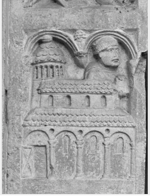
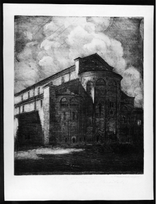

<div style="text-align: center; margin-bottom: 20px;">
  <a href="index.html">🏠 Home</a> |
  <a href="topic.html">🏛️ Topic</a> |
  <a href="methodology.html">⚒️ Methodology</a> |
  <a href="gaps.md">🔍 Identifying Gaps</a> |
  <a href="prompts.md">💬 LLM Prompts</a> |
  <a href="triples.md">🔗 RDF Triples</a> |
  <a href="challenges.md">⚠️ Challenges</a> |
  <a href="conclusion.md">✅ Conclusion</a>
</div>

# RESEARCH ABOUT OUR TOPIC

## Query 1 — Does ArCo contain our topic?

The first step was to verify whether the ArCo Knowledge Graph already contains an entity representing our selected topic, **[Abbazia di Nonantola](https://dati.beniculturali.it/lodview-arco/resource/HistoricOrArtisticProperty/0100210793.html)**.

### Explanation of keywords used:
- **`DISTINCT`**: eliminates duplicate results.
- **`FILTER`** and **`REGEX`**: used to retrieve more specific information. `FILTER` restricts results based on conditions; `REGEX` enables pattern matching inside string values.
- **`cp`**: stands for Cultural Property.

### 🔍 SPARQL Query:

```sparql
PREFIX rdf: <http://www.w3.org/1999/02/22-rdf-syntax-ns#>
 PREFIX arco: <https://w3id.org/arco/ontology/arco/>
 PREFIX a-cd: <https://w3id.org/arco/ontology/context-description/>

 SELECT DISTINCT ?cp
 WHERE {
 ?cp a arco:HistoricOrArtisticProperty ;
 rdfs:label ?l .
 FILTER(REGEX(?l, "Abbazia di Nonantola", "i")
 }
```

### ✅ Results:
The query confirmed that ArCo does contain entities related to our topic. These IRIs will be very useful as subjects for the RDF triples we plan to create with new enriched data.

### 📸 Screenshot of Results


### 🧾 IRIs Found
[Formella](https://dati.beniculturali.it/lodview-arco/resource/HistoricOrArtisticProperty/0800221017-1_14.html)
[Veduta abside](https://dati.beniculturali.it/lodview-arco/resource/HistoricOrArtisticProperty/0100210793.html)

---

## Query 2 — Finding depictions of the Abbazia

In this query, we aimed to find **visual representations** (e.g., images) of **[Abbazia di Nonantola](https://dati.beniculturali.it/lodview-arco/resource/HistoricOrArtisticProperty/0100210793.html)**.  
We used the **`OPTIONAL`** keyword to retrieve data only if available (i.e., if a depiction exists). We removed `DISTINCT` and used `*` to obtain all possible variables in the results.

### Explanation of keywords used:
- **`OPTIONAL`**: allows inclusion of additional data (e.g., depictions) if they are available, without excluding results where this information is missing.
- **`*`**: retrieves all available variables for each match.
- **Two `FILTER(REGEX)`**: allow us to narrow down results using both terms "Abbazia" and "Nonantola".

---

### 🔍 SPARQL Query:

```sparql
PREFIX rdf: <http://www.w3.org/1999/02/22-rdf-syntax-ns#>
PREFIX rdfs: <http://www.w3.org/2000/01/rdf-schema#>
PREFIX arco: <https://w3id.org/arco/ontology/arco/>
PREFIX a-cd: <https://w3id.org/arco/ontology/context-description/>
PREFIX foaf: <http://xmlns.com/foaf/0.1/>

SELECT * 
WHERE { 
  ?cp a arco:HistoricOrArtisticProperty ; 
      rdfs:label ?l .
  FILTER(REGEX(?l, "Abbazia", "i"))
  FILTER(REGEX(?l, "Nonantola", "i"))
  OPTIONAL { ?cp foaf:depiction ?depiction }
}
```

### ✅ Results
The query returned the same IRIs found in Query 1, but this time it included depictions. These are useful for enriching the knowledge graph with visual content.

### 📸 Screenshot of Results


🖼️ Depictions Found


