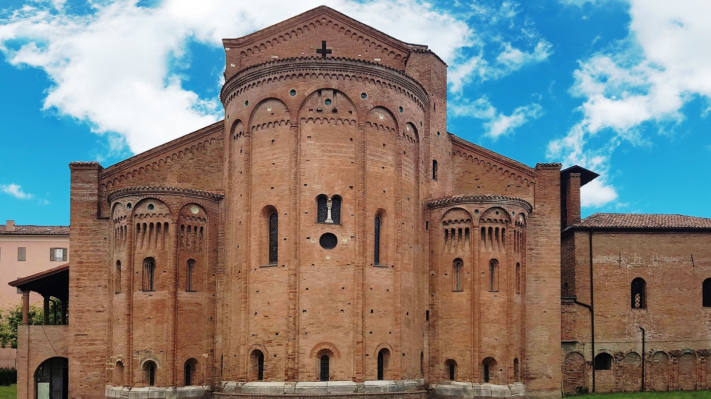

  <a href="index.html">🏠 Home</a> |
  <a href="methodology.html">⚒️ Methodology</a> |
  <a href="sparql.html">📊 SPARQL&Results</a> |
  <a href="gaps.md">🔍 Identifying Gaps</a> |
  <a href="prompts.md">💬 LLM Prompts</a> |
  <a href="triples.md">🔗 RDF Triples</a> |
  <a href="challenges.md">⚠️ Challenges</a> |
  <a href="conclusion.md">✅ Conclusion</a>

# Abbazia di Nonantola  
_A Hidden Treasure in the Province of Modena_

## Why Abbazia di Nonantola?

Abbazia di Nonantola is significant for several reasons. It stands as a symbol of medieval history, religious tradition, architectural beauty, and cultural richness. Founded in the 8th century, the abbey served as a key centre of power, hospitality, and pilgrimage during the Middle Ages.

As the official cultural page highlights,  
> “It is a place where one can touch the European Middle Ages in an admirable way.”

Despite its historical and cultural importance, the abbey is **not currently part of the UNESCO World Heritage List**, and its representation in structured knowledge graphs remains limited.

We selected Abbazia di Nonantola for this project because:

- It is widely known and cherished in the region of **Emilia-Romagna**  
- Its **historical and religious relevance** makes it easy to draw parallels with other heritage sites  
- While existing descriptions are historically accurate, there is room to **enhance its semantic representation** with additional details and contextual links

---

## Objectives

- To explore the **ArCo ontologies** using the official SPARQL endpoint in order to extract relevant and meaningful information about the abbey  
- To use **Large Language Models (LLMs)** such as Gemini and ChatGPT to produce new knowledge and propose **RDF triples** that could enrich the ArCo Knowledge Graph
